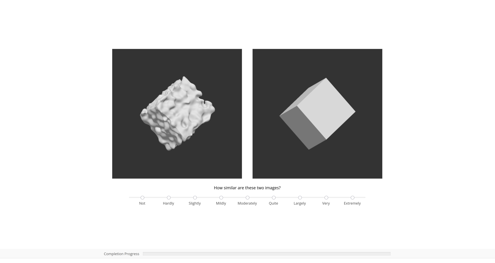

# Noise Example Page

This repository contains supplemental material for the paper:

> A. Sterzik, N. Merk, and K. Lawonn. **Evaluating the Perceptual Space of Surface Noise for Visualization**. *Computer Graphics Forum*, 2026. DOI: [10.1111/cgf.70454](https://doi.org/10.1111/cgf.70454)

Additional supplemental material is available on OSF: <https://osf.io/pe8h6/>.

## Artifact Description

This artifact is a minimal WebGL example page that reproduces trials similar to those used in the perceptual studies from the paper. Each trial shows two procedurally generated surface-noise stimuli and asks the viewer to rate their visual similarity.

The page generates noisy 3D primitives directly in the browser using GLSL shaders.

This page is intended as a compact executable example. It is not the full experimental deployment used for data collection.

## Requirements

The only runtime requirements are:

- a local HTTP server, for example the one included with Python
- a WebGL2-capable browser
- internet access for jsPsych, which is loaded from `unpkg.com`

No build step is required. Any operating system is fine as long as it can serve this repository over HTTP and open it in a WebGL2-capable browser.

## Running the Example

Start a local server from the repository root, then open the page in your browser.

On Linux or macOS with Python 3:

```sh
python3 -m http.server 8002 --bind 127.0.0.1
```

On Windows with Python installed:

```powershell
py -3 -m http.server 8002 --bind 127.0.0.1
```

If `py -3` is not available on Windows, try:

```powershell
python -m http.server 8002 --bind 127.0.0.1
```

Then open:

```text
http://127.0.0.1:8002/index.html
```

Any other static file server is also fine as long as it serves this repository root over HTTP. Opening `index.html` directly from the file system is not recommended, because the page loads shader files with `fetch()`, which browsers may block for `file://` pages.

Press `Ctrl-C` in the terminal to stop the server. If port `8002` is already in use, choose a different port and open the matching URL.

## Replicability Notes

The stimuli in the original studies and in the paper figures were generated with random seeds. Therefore, the images produced by this example page are not identical to the images in the paper.

For this replicability package, the page uses the fixed seed `12345`.

The following image is a reference output from this package and corresponds to the intended visual content for the first reproducible trial. It is conceptually related to Figure 2 in the paper, but is not expected to match that figure exactly because the paper figure was produced with a different random seed.



## Automatic Script

This repository also contains an automated unix script for starting a local python server and opening the browser window.

It was checked in this environment:

```text
Ubuntu 24.04.4 LTS
Python 3.13.13
```

The provided script starts the local server and opens the page in the default browser:

```sh
./run.sh
```

The script opens:

```text
http://127.0.0.1:8002/index.html
```

Leave the terminal open while viewing the page. Press `Ctrl-C` in the terminal to stop the server.
